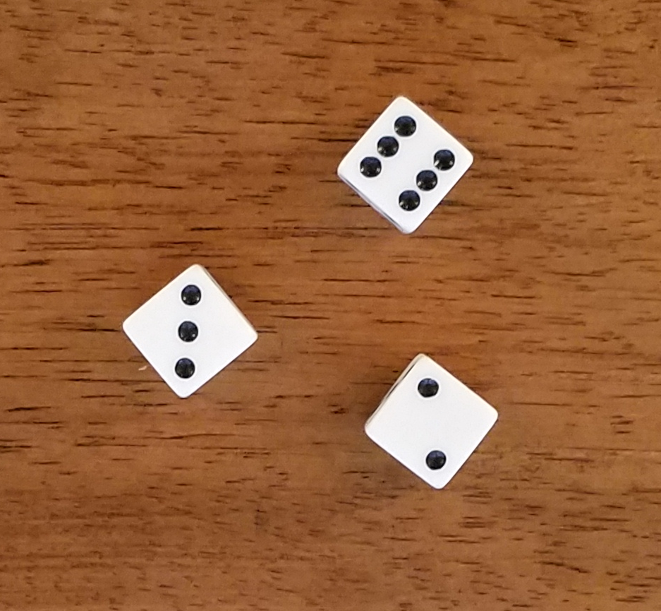

# Dice Counting Challenge

This was one of several challenges required to apply for a computer vision relate job.  The challenge objective was to do the following:
* detect all dice in an image and outline each die
* determine the number of dots shown in each die
* display the total number of dots shown in the image

Computer vision work performed using the [OpenCV package](https://github.com/skvark/opencv-python) in Python.

### Here is an example an example input image:

### Here is the expected output image:
